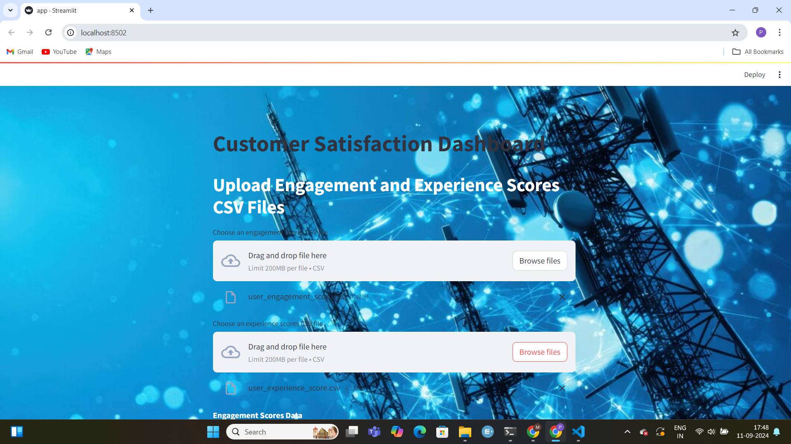
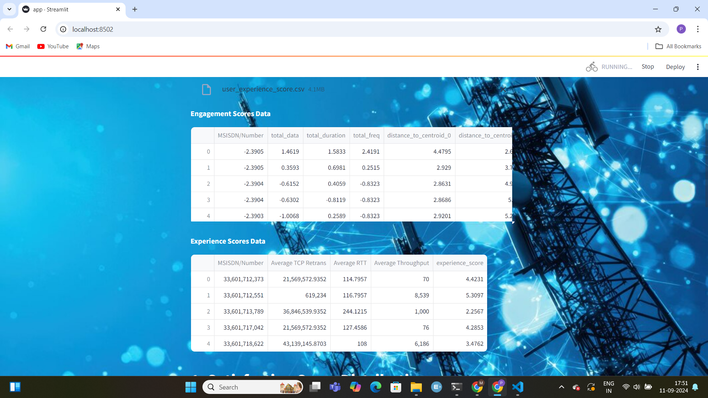
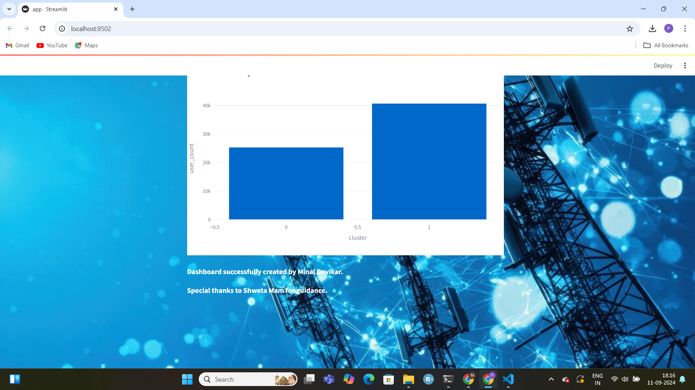

# User Analytics in the Telecommunication Industry

## Overview

This project aims to analyze user data for a telecommunication company, TellCo, to assess its potential for growth and make recommendations on whether the company is worth purchasing. The analysis is carried out using a telecommunication dataset that includes user behavior and activity data. The insights are delivered through a web-based dashboard and a detailed written report.

## Situational Overview

You are working for a wealthy investor who specializes in purchasing undervalued assets. The investor’s due diligence involves a detailed analysis of the data underlying the business to identify opportunities for profitability. Previously, you helped increase profits by 25% through targeted analysis in the delivery industry. Now, the investor is considering purchasing TellCo, a mobile service provider in the Republic of Pefkakia, and needs a comprehensive analysis of the company’s data to decide whether to proceed with the purchase.

## Data

The analysis is divided into four main objectives:

1. **User Overview Analysis**
2. **User Engagement Analysis**
3. **Experience Analytics**
4. **Satisfaction Analysis**

### Task 1 - User Overview Analysis

Objective: Understand user behavior and provide actionable insights.

- **Sub-task 1.1**: Aggregate user data including the number of sessions, session duration, total data (DL & UL), and data volume per application (Social Media, Google, Email, YouTube, Netflix, Gaming).
- **Sub-task 1.2**: Perform exploratory data analysis (EDA) to:
  - Describe variables and data types.
  - Analyze basic metrics (mean, median, etc.).
  - Conduct non-graphical and graphical univariate analysis.
  - Perform bivariate analysis to explore relationships between applications and data usage.
  - Segment users into decile classes based on session duration.
  - Compute a correlation matrix and perform dimensionality reduction using PCA.

### Task 2 - User Engagement Analysis

Objective: Assess user engagement with applications and segment users based on engagement metrics.

- **Sub-task 2.1**: 
  - Aggregate metrics per customer ID (MSISDN) and report the top 10 customers per metric.
  - Normalize engagement metrics and apply k-means clustering to classify users into engagement groups.
  - Compute and interpret engagement metrics for each cluster.
  - Aggregate user traffic per application and derive top 10 engaged users.
  - Plot the top 3 most used applications.
  - Determine the optimal number of k for clustering and interpret findings.

### Task 3 - Experience Analytics

Objective: Evaluate user experience based on network parameters and device characteristics.

- **Sub-task 3.1**: Aggregate user experience metrics (TCP retransmission, RTT, handset type, and throughput) and treat missing values.
- **Sub-task 3.2**: List top, bottom, and most frequent values for TCP, RTT, and throughput.
- **Sub-task 3.3**: Analyze and report the distribution of throughput and TCP retransmission by handset type.
- **Sub-task 3.4**: Perform k-means clustering on experience metrics and describe each cluster.

### Task 4 - Satisfaction Analysis

Objective: Analyze customer satisfaction based on engagement and experience metrics.

- **Sub-task 4.1**: Assign engagement and experience scores to each user using Euclidean distance.
- **Sub-task 4.2**: Calculate and report the top 10 satisfied customers based on average engagement and experience scores.
- **Sub-task 4.3**: Build and evaluate a regression model to predict satisfaction scores.
- **Sub-task 4.4**: Run k-means clustering on engagement and experience scores (k=2) and analyze clusters.
- **Sub-task 4.5**: Aggregate average satisfaction and experience scores per cluster.
## Dashboard

.png)
.png)
.png)

